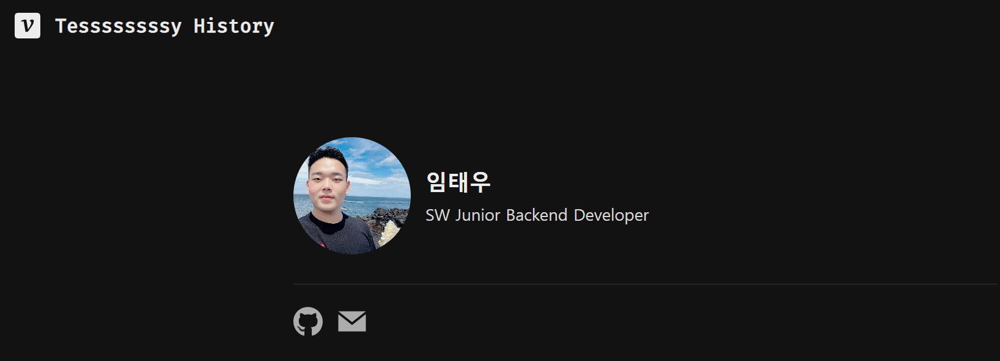
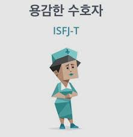
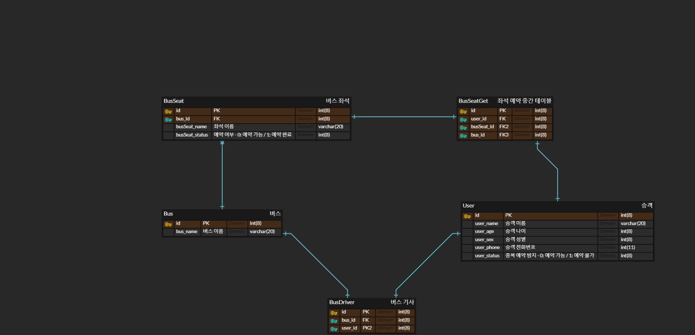

# be02-1st-taewoo-MarketWebAdminProject

This repository is produced for practicing Git and Github in Hanwha system sw beyond bootcamp.
 
 
 
 

# :wave: 자기 소개
## :waxing_crescent_moon: 이름
임태우
 
 
 
## :crescent_moon: 사진

[velog](https://velog.io/@ewoo97)
[github](https://github.com/Tesssssssssy)
 
 
 

## :first_quarter_moon: MBTI

 
 
 

## :waxing_gibbous_moon: 인사

안녕하세요! 임태우입니다.      

저는 학부 때 몇몇 프로젝트 경험이 있고  
특히 올 한 해 동안 기업 연계 프로젝트에서 백엔드 담당으로   
 DB Schema 및 ERD 설계 , 이에 따른  API 개발 경험을 했습니다.  
함께 팀원이 된다면 큰 도움이 될 수 있도록 열심히 하겠습니다.  
 
잘 부탁드립니다!

 
 
 

## :full_moon: 이번 주 DB 설계 팀 프로젝트 예상 주제
 

버스 좌석 예약 시스템 (Not 결제, Only 예약)   

- 10대의 버스 有. (더 이상 늘거나 줄지 않는다는 가정)  

- 각 버스 당 20개의 좌석 有.
- 회원 가입한 유저만 버스 예약 가능.
- 모든 버스엔 오로지 1명의 버스 기사 배정.
- 1명의 유저가 1개의 버스 좌석을 예약하면 해당 좌석 예약 불가.
- 1명의 유저가 1개의 버스 좌석을 예약하면 다른 좌석 예약 불가.  
- .........

 
 

#### :small_red_triangle_down: ERD 및 DB Schema

 
 

 
 

지난 설계 실습 때 일부 진행한, 완성되지 않은 모습입니다.  
큰 틀에서의 테이블 구조와 대략적인 CRUD Rest API 정도만 생각해 둔 상황입니다.

함께할 팀원들의 의견에 따라 주제는 얼마든지 변경될 수 있고  
이 주제로 진행된다면 추후에 팀원들의 의견을 반영해 테이블 구조, 관계, 기능 등이 변경될 예정입니다.

